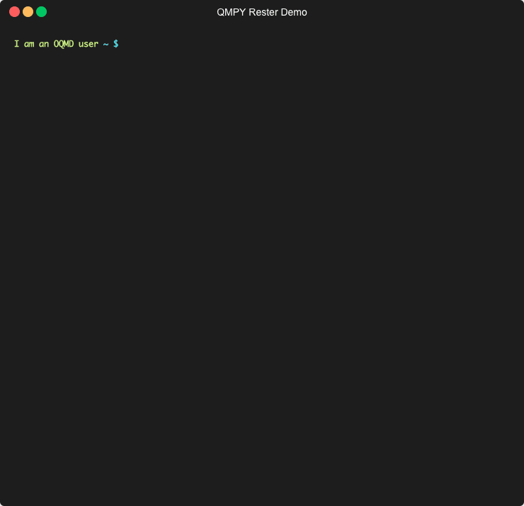

================
OQMD RESTful API
================

.. role:: query-url(literal)
.. role:: field(literal)

Introduction
============

RESTful API is now supported at (http://oqmd.org)! It allows the users to access the data of around 700,000 materials easily by using simple HTTP requests. Downloading the entire SQL database is no longer required to extract materials data unless the DFT calculation-related information is to be viewed. This system is implemented within Django Python API framework. The querying on database is supported with a form-based user interface at (http://oqmd.org/api/search). But the documention provided in this page may be used for a more flexible querying and eliminating the need to use a UI. 
OQMD RESTful API is a new addition to the general **qmpy** python API. The direct database query using qmpy API on commandline to a locally hosted version of OQMD database is still fully supported in addition to the RESTful part.

Querying
========

A simple request can be made like this 
:query-url:`http://oqmd.org/oqmdapi/formationenergy?fields=name,entry_id,spacegroup,ntypes,band_gap,delta_e&filter=element_set=(Al-Fe),O`::

     {
       "links": {
        "next": "http://oqmd.org/oqmdapi/formationenergy?fields=name%2Centry_id%2Cspacegroup%2Cntypes%2Cband_gap%2Cdelta_e&filter=element_set%3D%28Al-Fe%29%2CO&icsd=True&limit=2&offset=2",
        "previous": null,
        "base_url": {
            "href": "http://oqmd.org/oqmdapi",
            "meta": {
                "_oqmd_version": "1.0"
            }
        }
       },
       "resource": {},
       "data": [
        {
            "name": "NaAlH2CO5",
            "entry_id": 16974,
            "spacegroup": "Imma",
            "ntypes": 5,
            "band_gap": 5.255,
            "delta_e": -2.05739610121138
        },
        {
            "name": "CaAl2SiH4O8",
            "entry_id": 16995,
            "spacegroup": "I41/a",
            "ntypes": 5,
            "band_gap": 5.087,
            "delta_e": -2.49008973723542
        }
       ],
       "meta": {
        "query": {
            "representation": "/formationenergy?fields=name,entry_id,spacegroup,ntypes,band_gap,delta_e&icsd=True&limit=2&filter=element_set=(Al-Fe),O"
        },
        "api_version": "1.0",
        "time_stamp": "2019-10-08 15:13:12",
        "data_returned": 2,
        "data_available": 1078,
        "comments": "",
        "query_tree": "",
        "more_data_available": true
       },
       "response_message": "OK"
     }

URL Format
~~~~~~~~~~

Primary Query Fields
--------------------
- Materials-based keys:
    -  :field:`composition`: compostion of the materials or phase space, e.g. Al2O3, Fe-O
    -  :field:`icsd`: whether the structure exists in ICSD, e.g. False, True, F, T
    -  :field:`noduplicate`: whether the data should include duplicate entries or not, e.g. False, True, F, T
- Sub-query:
    -  :field:`filter`: customized filters, see :ref:`kw-ref`, example usage::

        filter=element_set=(S,O) AND (NOT element=As) AND stability=0

- Pagination:
    -  :field:`limit`: number of data return at once, e.g. 100, (default: 50)
    -  :field:`offset`: the offset of data return, e.g. 100, (default: 0)
- Sorting:
    -  :field:`sort_by`: the property on which the data has to be sorted, available attributes: :field:`None`, :field:`delta_e`, :field:`stability`, (default: None)
    -  :field:`sort_offset`: the offset if :field:`sort_by` is used, e.g. 100
    -  :field:`desc`: whether output result in descending order, e.g. False, True, F, T, (default: False)
- Response:
    -  :field:`format`: response format, available attributes: :field:`api`, :field:`json`, :field:`xml`, :field:`yaml`
    -  :field:`fields`: return subset of fields, see :ref:`kw-ref`, example usage::

        fields=sites,natoms,names

.. _kw-ref:

Available keywords for :field:`fields` and :field:`filter`
----------------------------------------------------------
Keywords exclusively available for usage in :field:`filter`: 
    - :field:`element_set`: the set of elements that the compound must have, :field:`-` for *OR*, :field:`,` for *AND*, e.g. (Fe-Mn),O
    - :field:`element`: specify the elements inclusion or exclusion of individual elements  
    - :field:`generic`: chemical formula abstract, e.g. AB, AB2

Keywords exclusively available for for usage in :field:`fields`:
    - :field:`sites`: list of atomic sites within the unit-cell
    - :field:`formationenergy_id`: ID of this instance in formation energy dataset
    - :field:`duplicate_entry_id`: OQMD ID of the preferred entry with this same crystal structure
    - :field:`unit_cell`: unit cell dimensions (an array of 3x3) 
    - :field:`fit`: the type of analysis
    - :field:`calculation_label`: DFT-calculation configuration
    - :field:`icsd_id`: ICSD ID of this structure, if it exists
    - :field:`composition_generic`: chemical formula abstract
    - :field:`name`: name of the compound

Keywords commonly available for both :field:`filter` and :field:`fields`
    - :field:`prototype`: structure prototype of that compound, e.g. Cu, CsCl
    - :field:`spacegroup`: the space group of the structure, e.g. "Fm-3m" (make sure to add double quotes)
    - :field:`natoms`: number of atoms in the supercell, e.g. 2, >5
    - :field:`volume`: volume of the supercell, e.g. >10
    - :field:`ntypes`: number of elements types in the compound, e.g. 2, <3
    - :field:`stability`: hull distance of the compound, e.g. 0, <-0.1,
    - :field:`delta_e`: formation energy of that compound, e.g. <-0.5,
    - :field:`band_gap`: band gap of the materials, e.g. 0, >2
    
Response Format
~~~~~~~~~~~~~~~
1. Standard Django API Format
2. JSON
3. XML
4. YAML

More Example Queries
~~~~~~~~~~~~~~~~~~~~
1. ``http://oqmd.org/oqmdapi/formationenergy?fields=name,entry_id,icsd_id,prototype,ntypes,natoms,volume,delta_e,band_gap,stability``
   ``&limit=50&offset=0&sort_offset=0&noduplicate=False&desc=False&filter=stability<0.5 AND element_set=(Al-Fe),O AND (ntypes>=3 AND natoms<9) OR ntypes<3``
   
 Here, the `filter` key contains a logical expression using `AND` and `OR` functions. Also, response format filters such as `desc`, `noduplicate`, etc. are also shown in this example

2. :query-url:`http://oqmd.org/oqmdapi/formationenergy`

 All the properties of all materials

3. :query-url:`http://oqmd.org/oqmdapi/formationenergy?fields=name,entry_id,band_gap&limit=50&offset=350&filter=stability=0.0`

 Limit and offset

4. ``http://oqmd.org/oqmdapi/formationenergy?fields=name,entry_id,spacegroup,prototype&sort_by=delta_e&limit=50&sort_offset=350``
   ``&noduplicate=True&desc=False&filter=stability=0``

 Showing the use of `sort`, `sort_offset`, and `noduplicate`

Practical Data Retrieval
~~~~~~~~~~~~~~~~~~~~~~~~

Python API Wrapper
------------------
A python wrapper `qmpy_rester <https://pypi.org/project/qmpy-rester>`_ for OQMD API is publicly available. The source code is open on `github <https://github.com/mohanliu/qmpy_rester>`_.

Command line
------------
Use :field:`wget` or :field:`curl`::

    wget "http://oqmd.org/oqmdapi/formationenergy?fields=name,entry_id,delta_e&filter=stability=0&format=json" -O outfile.json

or 

::

    curl -o outfile.yaml "http://oqmd.org/oqmdapi/formationenergy?fields=name,entry_id,delta_e&filter=stability=0&format=yaml"

Web Browser
-----------
:field:`CTRL+S` on the webpage

Additional notes
~~~~~~~~~~~~~~~~

Pagination
----------
Pagination is a particularly useful feature while viewing queried data in the web browser as it avoids loading a large file containing information of hundreds of thousands of materials in a single webpage. Pagination can avoid a possible browser crash and thus a full data-loss in such a data overload scenario by returning data in smaller subsets along with URLs to the :field:`next` and :field:`previous` subsets in the :field:`links` section of the returned result. By default, the maximum data returned in each subset, references as :field:`limit`, is set to be 50. 

OPTiMaDe RESTful Specification
~~~~~~~~~~~~~~~~~~~~~~~~~~~~~~

The Open Databases Integration for Materials Design (`OPTiMaDe.org <https://www.optimade.org/>`_) consortium aims to make materials databases interoperational by developing a common REST API. This specification provides a detailed set of rules about keywords for materials data, certain rules about data lookup flexibility, and format of the returned data.

Currently OQMD's RESTful implementation is compatible with the OPTiMaDe v0.9.5 specification and we will be updating it to v0.10.0 in the near future. There are a few notable differences between OQMDAPI and OPTiMaDe API because the former follows the traditional qmpy API keywords which had been under use in OQMD database since its inception. 

For example, the number of different types of element species consisting a particular chemical compound is referenced by :field:`ntypes` keyword in qmpy API (and thus also in OQMD RESTful API) while the same quantity is referenced as :field:`nelements` in OPTiMaDe API. Queries made in either APIs are processed internally within the same workflow following the initial keyword conversions.

OPTiMaDe: Example Queries
-------------------------
1. ``http://oqmd.org/optimade/structures?filter=ntypes=3%20AND%20elements=Al,Mn``
2. ``http://oqmd.org:8080/optimade/structures?filter=_oqmd_band_gap=0 OR (_oqmd_band_gap<0.5 AND nelements>3) AND elements=O``
